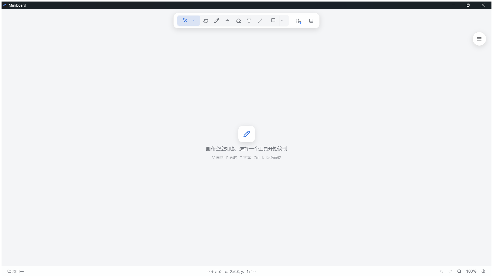

# Miniboard

**English** | [简体中文](./README.md)

[](https://opensource.org/licenses/MIT)
[](https://github.com/aaget123/miniboard/releases)
[](https://github.com/aaget123/miniboard/actions)

A **local-first, fully offline hand-drawn whiteboard**. The desktop app runs on Tauri 2 and renders its canvas with leafer-ui; all project data and AI custom tools are stored on your own disk (customizable directory) — no cloud dependency.

## 📸 Screenshot



## ✨ Features

- **Drawing tools**: pressure-sensitive freehand pen, line, arrow, rectangle, ellipse, text, frame, eraser (segmented stroke erase), marquee, lasso, etc., all driven by a unified tool registry; automatically returns to the Select tool after drawing (toggle in Settings → Appearance → Drawing)
- **Editing**: duplicate (`Ctrl+D`), delete, and other handy editing operations; hold `Alt` and drag to drop a duplicate of the selection (clone-on-drop)
- **AI assistant** (OpenAI-compatible API): chat mode is aware of the canvas; edit mode lets the AI create custom drawing tools at runtime (guarded by smoke tests); multimodal screenshot support; custom tools can be imported / exported in the open `custom-tools.json` format, edited in-app, and tracked with usage stats
- **Tidy & beautify**: recognize hand-drawn shapes and convert them into standard shapes in one click; convert standard shapes into a hand-drawn rough style in one click (rough.js, reproducible seed, adjustable roughness 0–2)
- **Text typography**: alignment / font family / weight slider (100–900); toggle regular/bold quickly with `Ctrl+B`
- **Arrow endpoint styles**: both ends of lines / arrows can independently use arrowhead, triangle, dot, circle, and other endpoint styles
- **Frame element**: the `F` key creates a dashed frame (Figma-style); inner elements follow when the frame moves as a whole; supports importing MD / code / text files as content frames (auto-sized to content, extra-tall content collapsible and scrollable); supports frame focus (viewport zooms to the frame); dropped files are routed by type — images insert straight onto the canvas, PDFs render their first page as an image, text / code become content frames
- **Multi-project management**: independent canvases + autosave; the last project is restored automatically on launch
- **Customizable data directory**: projects and AI tools are stored as local files (default: system app-data directory; changeable with automatic migration)
- **Export**: PNG bitmap / SVG vector / PDF document, lossless element structure

See [Feature Details](#feature-details) below for the complete feature list.

## 🚀 Installation

**Option 1: Download** (recommended)
- Grab the Windows installer (NSIS) or portable exe from [Releases](../../releases)
- Double-click to install and start using — no configuration needed

**Option 2: Build from source**
1. Install [Rust](https://www.rust-lang.org/tools/install) and [Node.js](https://nodejs.org/) (≥ 18)
2. Building the desktop app on Windows also requires the [MSVC toolchain & Windows SDK](https://learn.microsoft.com/windows/msvc/building-on-the-command-line) (Visual Studio Build Tools recommended)
3. Clone the repo and run:

```bash
npm install
npm run tauri build        # or Windows: powershell -ExecutionPolicy Bypass -File tools/build-tauri.ps1
```

Build output lands in `src-tauri/target/release/`.

## 🖥️ Quick Start (Development)

During development it is recommended to debug directly in the browser — no need to build an exe (the browser version is functionally identical to the desktop app):

```bash
npm install
npm run dev        # opens http://localhost:5173 in the browser
```

Run `npm run tauri dev` when you need to verify desktop integrations (file dialogs, system storage, etc.).

## 🤖 AI Assistant Configuration

The AI assistant uses OpenAI-compatible APIs (works with local Ollama / vLLM / various relay services):

1. Open ⚙ Settings → **AI Model** tab
2. Click "New Profile" and fill in:
   - **Name**: anything you like, e.g. `Ollama`
   - **Base URL**: e.g. `http://localhost:11434/v1`
   - **API Key**: any value for local services; your real key for relay services
   - **Model**: e.g. `qwen2.5:7b` (or use "Fetch model list" to pull it automatically)
   - **Multimodal**: when enabled, chat mode attaches a canvas screenshot with each message (requires a vision-capable model)
3. Click "Test Connection" to verify, then select a profile to activate it

> **Privacy**: API keys and model profiles are stored locally only; conversation content is sent only to the API URL **you** configure. The app itself collects nothing.
>
> **Security note**: API keys are stored as plaintext in the WebView's localStorage (on disk under the app data dir, `EBWebView`) without additional encryption. Avoid saving sensitive keys on shared computers; if you need stronger protection, prefer a local service (e.g. Ollama) that requires no real key.

## 💾 Data Storage

| Data | Default location | Notes |
| --- | --- | --- |
| Project canvases | `%APPDATA%\com.miniboard.app\projects\` | project index `index.json` + one scene file per project |
| AI custom tools | `%APPDATA%\com.miniboard.app\custom-tools.json` | definitions of AI-generated drawing tools |
| UI preferences / AI profiles | WebView2 localStorage (under `EBWebView` in the same dir) | theme, toolbar layout, model profiles, etc. |

- **Change directory**: ⚙ Settings → **Data** tab → "Change Directory…" — old data migrates automatically to the new directory and is restored after a restart
- **Backup**: just copy the data directory (do it while the app is closed)
- When debugging in the browser, data lives in localStorage and never touches the disk directory

## 🧱 Tech Stack

| Layer | Tech |
| --- | --- |
| Desktop shell | Tauri 2 (Rust) |
| Frontend build | Vite 6 + TypeScript |
| Canvas rendering | leafer-ui 2.2.9 + @leafer-in/editor / arrow / export / text-editor |
| Stroke outline | perfect-freehand (pressure-sensitive stroke smoothing and outline generation) |
| Hand-drawn look | roughjs (standard shapes → hand-drawn paths, reproducible seeds) |
| AI assistant | OpenAI-compatible API (SSE streaming): fetched directly in the browser, relayed through @tauri-apps/plugin-http on desktop |

## 📁 Project Structure

```
src/
├── ai/                 # AI assistant: dual-mode chat / tool calls / settings / @ selection
│   ├── panel.ts        # AI panel (chat & edit modes, @ selection, context compression, stop/timeout)
│   ├── client.ts       # OpenAI-compatible client (SSE streaming / timeout & cancellation / model list / connection test)
│   ├── config.ts       # multi-profile AI config storage (localStorage, legacy single-profile auto-migration)
│   ├── prompts.ts      # dual-mode system prompts
│   ├── tools.ts        # canvas awareness / shape recognition / tool executor (update_elements field whitelist, create_elements official-format parsing)
│   └── types.ts
├── main.ts             # entry point: toolbar / status bar / shortcuts / context-menu wiring
├── storage.ts          # storage layer: multi-project management (project index + per-project scenes + legacy data migration + configurable data directory) / open / save-as / PNG & SVG export
├── types.ts            # element data structures, project metadata, tool types & unified capability rules
├── ui/
│   ├── toolbar.ts      # top toolbar (registry-driven rendering + grouped split buttons/dropdowns + fill toggle + custom layout & grouping preferences)
│   ├── selectionbar.ts # left floating selection bar (tidy / sketch / crop / style popover + text font size)
│   ├── statusbar.ts    # bottom-right status bar (project name + undo/redo/zoom + element info)
│   ├── toolsfloat.ts   # right circular floating toolbar (files / AI / clear / settings, draggable)
│   ├── exportdialog.ts # unified export dialog (PNG / SVG format choice)
│   ├── settings.ts     # settings dialog (appearance / toolbar / AI models / AI tools / system prompt / data directory)
│   ├── contextmenu.ts  # context menu (copy/paste/lock and other operations)
│   └── style.css
└── board/
    ├── canvas.ts       # canvas core: drawing / zoom / selection / eraser / images / clipboard / style application / serialization / hand-drawn style conversion / grid snapping & SVG export
    ├── bounds.ts       # element bounding-box math (shared by AI awareness / geometric interactions)
    ├── arrange.ts      # arrangement pure functions: align / distribute / flip / z-order (dedicated to the AI arrange_elements tool)
    ├── registry.ts     # unified tool registry: built-in + custom tools (AI add/remove/update, injected persistence adapters — desktop data-directory files / browser localStorage)
    ├── beautify.ts     # tidy: hand-drawn shape recognition & refinement (circle/ellipse/rect/polygon/line)
    ├── coords.ts       # element-local ↔ canvas-absolute coordinate conversion (shared by AI context descriptions and update_elements write-back)
    ├── offset.ts       # paste-offset pure function (shifts whole elements per coordinate semantics: line/arrow/path shift points/path, everything else shifts x/y)
    ├── svg.ts          # SVG export pure functions (element data → SVG string, shared by browser & desktop)
    ├── stroke.ts       # pressure-sensitive stroke wrapper (perfect-freehand: sample points → outline path)
    ├── rough.ts        # hand-drawn rendering layer (rough.js: standard shapes → sketch paths, reproducible seed)
    └── history.ts      # undo/redo
```

## 🧪 Testing

Core pure-function modules (coordinate conversion / shape recognition / paste offset / arrangement / tool registry) ship with unit tests:

```bash
npm test
```

## 🤝 Contributing

Issues and PRs are welcome! Please read [CONTRIBUTING.md](./CONTRIBUTING.md) first.

## 📄 License

[MIT](./LICENSE) © [aaget123](https://github.com/aaget123)

---

## Feature Details

- **Drawing tools**: select, pan canvas, pen, eraser, line, arrow, text, frame, etc. (toolbar driven by the unified tool registry; the AI can add custom tools at runtime)
  - **Grouped dropdowns**: same-type tools collapse into dropdown buttons — "Shapes ▾" (rectangle / ellipse / triangle / star and other shape tools), "Select ▾" (select / marquee / lasso), and "AI Tools ▾" (remaining AI-generated custom tools collapse here by default to keep the top bar flat-free); group buttons are split buttons — clicking the main button uses the group's current tool (the "group head"; picking any item in the menu switches it), clicking the arrow on the right opens the menu (menu items show their shortcuts on the right, and the bottom of AI Tools ▾ offers a "Manage AI Tools" shortcut); new shape-type tools created by the AI are filed into "Shapes ▾" automatically; custom-tool management lives in ⚙ Settings → "AI Tools" tab
  - **Custom toolbar** (⚙ Settings → "Toolbar" tab): laid out as separate tiled and grouped areas — tiled area (check to show on the top bar + drag to reorder, AI custom tools get an AI badge), grouped area (drag group heads to reorder groups on the top bar, synced live), and hidden area; drop position is decided by the upper/lower half of the target row to insert before/after; tool rows and group-button rows can be dragged into each other; dropping onto an auto-synced copy of a group button (dashed row) pins its position; checking/reordering previews the top bar live (past the suggested limit, overflow folds into "More ▾"); the custom layout persists to localStorage; checked tools tile in the configured order, unchecked grouped tools collapse into their dropdowns, unchecked standalone tools hide; "Restore Defaults" reverts to the initial layout in one click
    - **Custom groups**: "＋ New Group" at the top right of the group area creates custom groups (renameable / deletable); dragging any tool row onto a group head moves it into that group (empty groups still show and accept drops; dragging back onto a built-in group head restores default membership); a group button's head = the currently selected tool in its menu — picking another one switches it; the tiled and grouped areas stay separate — dragging a group head into the tiled area inserts the whole group button at the drop point (the group never splits apart), dragging a group-button row back to the group area removes it
  - The pen draws pressure-sensitive strokes (perfect-freehand): smooth variable-width outlines generated in real time, stroke thickness varying naturally with speed/pressure; selected strokes can be resized in the style popover (1–40, the outline recomputes for the new width), and while the pen tool is active the left bar shows a style button for pre-setting the default color/width of new strokes
  - The eraser erases by segment: erasing pen strokes and **lines/arrows** only removes the intervals covered by the eraser trail, splitting the remainder into independent strokes/segments (when a line splits, the first segment keeps the start arrowhead and the last keeps the end arrowhead); other elements are deleted whole once the eraser center touches them (a large-radius brush grazing an edge won't delete by mistake); **pending-delete preview** — hovering/dragging over targets shows a red dashed box around what will be deleted; locked elements are protected from erasure
    - **Adjustable eraser radius**: a radius slider shows in the left bar while the eraser is active; `[` `]` step it; the mouse wheel adjusts it in eraser mode (instead of zooming the canvas); the radius persists across launches
    - **Hold-for-temporary-eraser**: holding `E` borrows the eraser and releasing returns to your previous tool; a quick tap on `E` switches permanently (same as before)
  - **Arrow-key nudge**: arrow keys move selected elements 1px (auto-repeat when held); `Shift+1` zooms to fit all content, `Shift+2` zooms to the selected elements; double-clicking empty space creates a text element in place and enters editing
  - **Return to Select after drawing**: once a stroke or shape is finished, the app snaps back to the Select tool automatically (Excalidraw-like default); toggle it in ⚙ Settings → Appearance → Drawing
  - Shortcuts: `V` select / `H` pan / `M` marquee / `Q` lasso / `P` pen / `E` eraser / `L` line / `A` arrow / `R` rectangle / `O` ellipse / `T` text / `F` frame / `K` toggle AI assistant / `Ctrl+K` command palette / `Ctrl+B` bold text, plus `Alt`+drag to duplicate; every shortcut is customizable in ⚙ Settings → "Keyboard Shortcuts" tab (all actions + built-in tools rebindable, conflicts detected and flagged, one-click restore to defaults); AI custom tools can be assigned single-letter shortcuts (edited in the "AI Tools" tab)
- **AI assistant** (🤖 button or `K`, OpenAI-compatible API with streaming output):
  - **Chat mode**: senses the canvas through `get_canvas` (structured JSON: overall summary + element data, including shape descriptions, region labels, and absolute canvas coordinates; hand-drawn strokes come with their recognized shape too; elements created by the AI carry an `intent` field — the purpose self-reported at creation time, no purpose is guessed for elements without one; the summary includes element counts, content extent, and spatial distribution — where content clusters and where the canvas is empty at a glance) for conversation / critique / suggestions; turns ideas into flowcharts written onto the canvas via `draw_flowchart` (node rectangles and labels auto-group, connector arrows auto-bind to nodes — move a node and its connectors follow); when you explicitly ask to "draw / add / place element(s)", `create_elements` builds them directly in leafer's official JSON format (type and x/y required, line/arrow points in absolute canvas coordinates, no id needed — assigned automatically; an optional intent briefly self-reports why it was created and persists); batch tidying of elements (align / distribute / flip / z-order) happens in one `arrange_elements` call (semantic instruction + coordinates computed on the frontend, group members participate as a whole, locked elements skipped automatically); tidy hand-drawn strokes with `beautify_elements`, convert standard shapes to sketch style with `sketchify_elements`, adjust sketch roughness with `set_roughness` (all operate by id; locked elements are skipped, group members participate together); it never touches the canvas unless explicitly asked; within one conversation turn it won't call `get_canvas` again if the canvas hasn't been modified (tool-use discipline that saves rounds and tokens)
  - Long-conversation auto-compaction: history is managed against a token budget (~8000 including the system prompt); when exceeded, the earliest rounds are dropped automatically with a one-time notice; when only the current round remains, earlier canvas data shrinks into a placeholder note (the model can always re-run `get_canvas`), keeping recent context intact
  - **Generation controls**: while generating, the send button turns into a red "Stop" — click to abort immediately (already-output content is kept and the conversation continues); chat requests stop automatically after 90 seconds without response, connection tests / model-list probes time out at 15 seconds — nothing hangs forever
  - **Edit mode**: adds / modifies / deletes drawing tools at runtime under the unified capability rules (the AI writes generator code functions that take effect immediately and persist — desktop stores them in the data directory's custom-tools.json, browser stores them in localStorage); tool behavior comes in two kinds — **drag** (shape computed dynamically from the drag range, the default) and **click** (one click spawns a fixed-size element, such as stamps / sticky notes); a generator may return a single element or an array of elements (**combo tools**, e.g. title + underline — during the drag the companion elements preview in sync with the main draft, and release merges everything into one undo step); every add / update runs an automatic **smoke test** first (dangerous-code scan → sandboxed Worker execution + timeout kill → strict validation of return-value shape; failures return the specific reason so the AI can fix and retry), and after passing, a **sample drawing** is sketched automatically on the right side of the canvas for immediate inspection; a new tool sharing a type with an existing tool joins that tool's group dropdown; registry operations show tool-card receipts in the panel (icon + name + behavior class / group / shortcut badges); tool icons pass a character whitelist (1–2 characters of Chinese / letters / digits / common symbols; emoji and overlong symbols rejected, legacy data falls back to the default symbol automatically)
  - **Clear conversation**: the trash button in the panel header wipes the current conversation history in one click (canvas untouched); switching modes clears it automatically
  - **AI tool management**: ⚙ Settings → "AI Tools" tab — edit name / icon / shortcut / group and delete tools; the generator source is editable in place (changes run the smoke test before saving); import / export custom tools via the open `custom-tools.json` format (imports must pass the smoke test first); usage stats with a per-tool use-count badge, sorting by most used / recently used / name, and one-click cleanup of never-used tools
  - **@ selection**: select shapes and hit the panel's @ button — the AI focuses its analysis on those elements (selection data merges into the user message as a single injection, never truncated); when explicitly asked, `update_elements` optimizes them directly (color / size / position / text / endpoints, etc.), the whole round's changes merge into one undo step, and only @-selected elements change; writes are guarded by a field whitelist (appearance / geometry fields only, runtime fields always ignored)
  - **Settings** (☰ File & Tools → ⚙): theme switching (dark / light / follow system, canvas background and exports follow suit, automatic on OS theme changes) + canvas grid (see below) + AI model profile management — register multiple profiles (name / base URL / API Key / model / multimodal, saved to localStorage), activate by selecting, with edit, delete, and one-click connection testing (fetches the available model list for pick-or-confirm; falls back to a minimal request probe when /models is unavailable); with multimodal on, chat mode attaches canvas screenshots + a **Keyboard Shortcuts** tab (custom bindings for actions and built-in tools: recording-style capture + conflict detection + restore defaults, effective immediately)
- **In-app confirmations**: destructive actions — clearing the canvas and AI-triggered batch operations — confirm through in-app dialogs instead of native browser popups
- **Command palette** (`Ctrl+K`): centered search overlay indexing every drawing tool and global action (open/save/insert image/export/project management/settings/AI assistant/theme switch/clear canvas, etc.), ↑↓ to choose, Enter to run, Esc to close
  - **Keyboard shortcuts help**: "Shortcuts Help" inside the command palette lists every shortcut (dynamically reflecting your current custom bindings)
- **Empty-canvas welcome**: when the canvas is empty, faint centered text guides you (icon + "the canvas is empty — pick a tool and start drawing" + common shortcut hints); it fades out on the first draw and reappears after the canvas is cleared
- **Selection**: pixel-level hit-testing (lines/arrows/strokes tested against their actual stroke); thin lines get a 5px hit tolerance; transparent areas of hollow shapes let clicks pass through to elements underneath
- **Multi-click selection**: `Ctrl`/`Cmd`+click toggles elements in and out of the selection (click unselected to add, selected to remove), `Shift`+click accumulates (add-only, never removes); the edit box wraps all selected elements automatically; modifier-clicking empty space keeps the current selection (an accidental mid-flow click won't lose it), a plain click on empty space clears everything
- **Marquee / lasso**: tucked into the "Select ▾" group dropdown — marquee selects intersecting elements with a rectangular frame, lasso selects with a freehand closed loop
- **Drag inside the selection box**: press and drag on blank space inside the bounding box to move single or multiple selected elements as a whole (move cursor shown on hover)
- **Alt+drag to duplicate**: hold `Alt` and drag a selection to clone-on-drop — the original stays put and the drop plants a duplicate; disabled inside frames with content constraints enabled, where `Alt` keeps its usual meaning as the exemption that lets a drag leave the frame
- **Type-aware selection bar**: the left floating selection bar adapts its buttons to the element type — images show crop, lines/arrows show point-editing, text shows a font-size slider; hides automatically when you switch to a non-select tool or enter text editing, with fade transitions
- **Style editing**: with elements selected, tweak stroke color / fill color / stroke width (slider 1–40, numeric readout shown) / font size (text selections additionally show a 10–72 size slider in the style popover, resizing live); resizing a pen stroke recomputes its outline for the new width immediately
  - **Line style / opacity / corner radius**: three line styles (solid / dashed / dotted, applied to strokable shapes); opacity slider 0–100% (editable elements); corner-radius slider 0–100 (shown only when a single rectangle is selected, previewing live)
  - **Text typography**: with text selected, the style popover shows alignment (left / center / right), a font dropdown (default / common Chinese fonts / Western fonts), and a weight slider (100–900; `Ctrl+B` quickly toggles regular / bold for the whole element) — restored along with the file
  - **Arrow endpoints**: with a line / arrow selected, the style popover shows two endpoint button groups for start / end — arrow / triangle / dot / circle / none, set independently per end (arrow-type elements default to a triangle head at creation)
  - **Roughness**: sketchy elements show a "Roughness" slider in the style popover (0–2, 0.1 steps) — redrawn instantly with the same jitter seed, so the look survives undo / reload
  - **Recent colors**: non-basic colors picked in the color picker are remembered automatically in the style popover's "Recent" row (up to 4, kept locally), one click to reuse
  - Independent stroke and fill channels: click the "Stroke"/"Fill" buttons to switch the active channel; swatches and the custom color picker apply to the current one (fill = selected color at 15% alpha; clicking the Fill channel turns fill on automatically)
  - **Eyedropper color picker**: the style popover ships an eyedropper that samples pixels rendered on the canvas straight into the active stroke/fill channel
  - Fill toggle (icon button on the top toolbar: square with solid lower half): on = fill with the remembered fill color, off = remove fill; locked elements and images are unaffected; closed Path shapes (including AI-generated triangles/stars) support fill too
  - Text elements: both channels apply to the text color
- **Image insertion**: the "Insert Image" button on the right circular toolbar picks a local image and inserts it; it is selected automatically afterwards and can be moved / scaled / rotated (oversized images shrink to fit the viewport)
  - **Image cropping**: select an image and hit "Crop" on the selection bar to enter crop mode; drag the crop frame's edge/corner handles to adjust the range, double-click to apply (unrotated images only)
  - Edit boxes auto-focus — click and type directly; `Esc` exits editing; only actual content changes enter undo history, and empty text deletes itself without leaving a trace; double-clicking text/line elements while a non-select tool is active (e.g. right after drawing a title combo) switches to the Select tool automatically before entering editing — no manual switch needed
  - **Resize semantics**: with text selected, dragging resize handles — horizontal scaling re-wraps the text (font size unchanged), vertical scaling changes the font size directly, never stretching or distorting
- **Context menu**: tidy / sketch / copy / paste / cut / delete / select all / bring to front / send to back / lock / unlock / rectangle⇄frame conversion / content constraints / collapse content / focus frame (tidy & sketch show/hide smartly based on the selection, shared with the left selection bar; locked elements cannot be moved, scaled, or deleted)
  - Shortcuts: `Ctrl+C` copy / `Ctrl+X` cut / `Ctrl+V` paste / `Ctrl+A` select all; pasted elements land at the mouse's current position — the bounding box is recorded from the elements' actual rendered positions at copy time, and paste aligns the box center to the mouse (staying precise across canvas zoom / pan; absolutely-coordinated elements like line/arrow/path shift whole per coordinate semantics, never double-offset)
- **Tidy** (✨ button on the left floating selection bar): recognizes hand-drawn shapes intelligently and refines them into standard graphics — closed paths classify into circle / ellipse / rectangle (rotation supported) / triangle / quadrilateral / pentagon and other standard elements, near-straight lines become true segments, and remaining curvy lines get simplified by straightening (Douglas-Peucker, 5px tolerance); color and width survive, and results stay draggable (pen strokes recognize from their raw sample points; once recognized as an ellipse/line they are directly editable)
- **Sketch style** (✎ button on the left floating selection bar): one click turns selected standard shapes (rectangle / ellipse / line / arrow / polygon) into rough.js sketchiness (double lines + jittery strokes); the jitter seed saves with the element and reproduces exactly after undo/reload; AI awareness recognizes the original geometry underneath; repeat clicks on already-sketchy elements skip automatically; selected sketchy elements expose a roughness slider in the style popover (0–2, redrawn with the same seed)
- **Point editing for linear elements**: selecting a line / arrow / polygon shows draggable vertex handles — dragging endpoints reshapes in real time; double-click mid-segment adds a vertex; closed paths / angle locking supported (`Esc` or switching tools exits)
- **Arrow endpoint binding**: endpoints snap-bind to nearby element edges automatically; dragging the bound element carries the arrowhead along; bindings persist across file save/load; connectors from AI-generated flowcharts bind node rectangles automatically (move a node, the connector follows)
- **Frame element** (`F` key): creates a dashed frame (light fill, Figma-style); dragging the frame moves inner elements with it (elements fully inside attach automatically, including dragged-in ones; group relationships and locked elements excepted), persisting across file save/load
  - **Content frames**: drag MD / code / text files onto the canvas or choose them via "Import File" on the right bar to spawn content-typed frames — sized adaptively to their content (autoSize, long lines wrap, monospace rendering for code), content moves / scales / rotates / deletes in lockstep with the frame, persisting across file save/load; dropped images insert straight onto the canvas, dropped PDFs render their first page as an image (pdf.js lazy-loaded, max side 3000px)
    - **Collapse & scroll**: extra-tall content frames can collapse (fixed-height clipping; toggled via right-click "Collapse Content"); hovering the frame lets the mouse wheel scroll through its content; the scroll offset persists across file save/load
    - **Frame focus**: right-click "Focus Frame" zooms the viewport to the frame (repeat to exit focus and restore the previous view; session-scoped)
  - **Frame conversion & content constraints** (context menu): rectangle ⇄ frame one-click conversion (converting to rectangle releases attached content as free elements); frames toggle "Content Constraints" — when on, drawing and dragging inside clamp to the frame bounds; elements drawn / imported / dropped into a frame attach to it automatically (moving / scaling / rotating in lockstep, detaching when dragged out, expanded to world coordinates on SVG export)
- **Canvas grid** (⚙ Settings): enable grid display plus snapping for drawing/moves, spacing adjustable 4–100px (off by default); with snapping on, newly drawn shapes, drags inside frames, and single-selection moves align to grid lines (multi-selection moves don't snap, preserving relative positions); grid lines rebuild automatically on zoom / pan
- **Canvas zoom**: free zoom 10% ~ 800%; the initial view centers the canvas origin (0,0) in the viewport ("X0Y0 centered"), and resetting zoom returns to that view
  - Wheel: zooms around the mouse position — up zooms in, down zooms out
  - Status bar buttons: `−` zoom out / `100%` reset / `＋` zoom in (reset also resets canvas panning)
  - Shortcuts: `Ctrl+=` zoom in, `Ctrl+-` zoom out, `Ctrl+0` reset
  - The status bar shows the live percentage
- **Minimap overview**: hold `Ctrl` to overlay a minimap — simplified rectangles for every element plus the viewport box; click or drag inside it to navigate the canvas
- **Undo / redo**: `Ctrl+Z` / `Ctrl+Shift+Z` (or `Ctrl+Y`); ⬅ / ➡ buttons provided on the bottom-right status bar
- **Multi-project management** (⚙ Settings → Projects): create / switch / rename / delete multiple projects, each with an independent canvas and autosave; the last-open project restores automatically on launch, legacy single-project data migrates to "Project 1" automatically; the status bar's left edge shows the current project name; the storage directory is changeable in ⚙ Settings → "Data" tab (defaults to the system app-data directory; changing it migrates old data to the new directory automatically and restores on restart)
- **Storage**: autosaves to the current project (desktop writes to the data directory — default `%APPDATA%/com.miniboard.app`, changeable in ⚙ Settings → "Data" tab with automatic migration of project files and AI custom tools; browser writes to localStorage); project data and AI custom tools share one directory (`projects/index.json` + scene files, `custom-tools.json`); open / save-as JSON files; unified export entry ("Export" button on the right float or command palette → dialog picks PNG bitmap / SVG vector / PDF document, lossless element structure — ready for delivery / printing / further editing)

## UI Layout

An Excalidraw-style layout where floating widgets across regions never block each other:

- **Top-center toolbar** (persistent): every drawing tool (including the "Shapes ▾" / "Select ▾" group dropdowns) + default-style entry (sliders icon + current stroke-color dot, opens the style popover) + fill toggle (pure icon, aligned with the other buttons); when the window gets narrow, trailing tools fold into a "More ▾" menu automatically (active tool highlighted in sync); the layout is customizable in ⚙ Settings → "Toolbar" tab (check-to-tile + drag-to-reorder + group reordering and custom groups + live preview, persisted to localStorage)
- **Left floating selection bar** (appears with a selection; while the pen tool is active it shows only the style button for pre-setting new-stroke color/width): ✨ tidy / ✎ sketch / 🎨 style (dual stroke/fill channel swatches, color picker + eyedropper, width slider 1–40; buttons vary by element type — ✂️ crop for images, point-editing for linear elements, text alignment/font/weight, arrow-endpoint buttons, roughness slider for sketchy elements)
- **Right circular floating toolbar** (persistent): 📂 open / 💾 save / 📄 import file (content frames) / 🖼️ insert image / ⬇ export (dialog picks PNG / SVG / PDF) | 🤖 AI assistant | 🗑 clear / ⚙ settings (appearance + canvas grid + AI models + AI tool management + system prompt + data storage directory), buttons grouped by File / AI / Cleanup dividers; the main button is draggable (position remembered in localStorage, clamped back into the viewport on restore and window resize); delayed collapse on mouse-away guards against accidental dismissal; fades out of the way automatically while the AI panel is open
- **Bottom-right status bar** (translucent backing, switching to a light translucent backing under light themes): current project name + element count + cursor canvas coordinates, with ⬅ undo / ➡ redo / 🔍 − 100% ＋ on the right
- **Floating layers are mutually exclusive**: context menu / style popover / right-side panels displace one another — opening one collapses the others; `Esc` backs out layer by layer (point editing → image cropping → edit box → overlays); clicking blank space or losing focus closes overlays

## FAQ

**Q: The AI assistant won't connect?**
A: First click "Test Connection" in ⚙ Settings → AI Model tab. Common causes: base URL not ending in `/v1`, wrong key, nonexistent model name. Local Ollama uses `http://localhost:11434/v1`.

**Q: Where is my data stored? How do I back it up?**
A: See the [Data Storage](#-data-storage) section above. Default is `%APPDATA%\com.miniboard.app\`; copy that directory while the app is closed for a complete backup.

**Q: After changing the data directory, is the old data still there?**
A: Yes. Changing directories copies old data to the new one automatically (don't close the app mid-migration); the original directory's files remain, and you can delete them manually once everything checks out.

**Q: Is data shared between browser debugging and the desktop app?**
A: No. Browser data lives in localStorage, desktop data lives in the file directory — the two are fully independent.

**Q: Can AI-generated tools wreck the canvas?**
A: No. Tool generators pass three layers of protection: static dangerous-code scan → sandboxed Worker execution + timeout kill → strict return-value validation, and only pure JavaScript math is allowed (no page / network / loop access).
